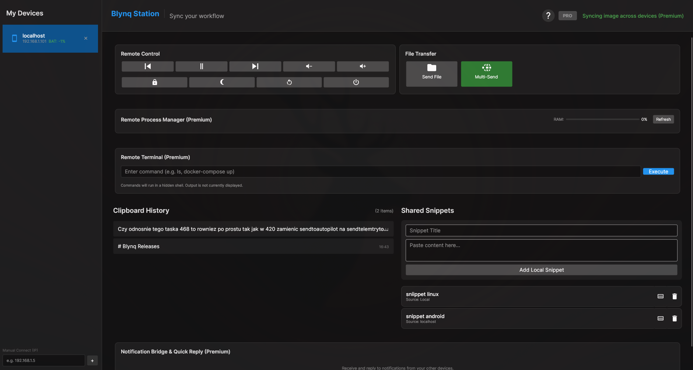
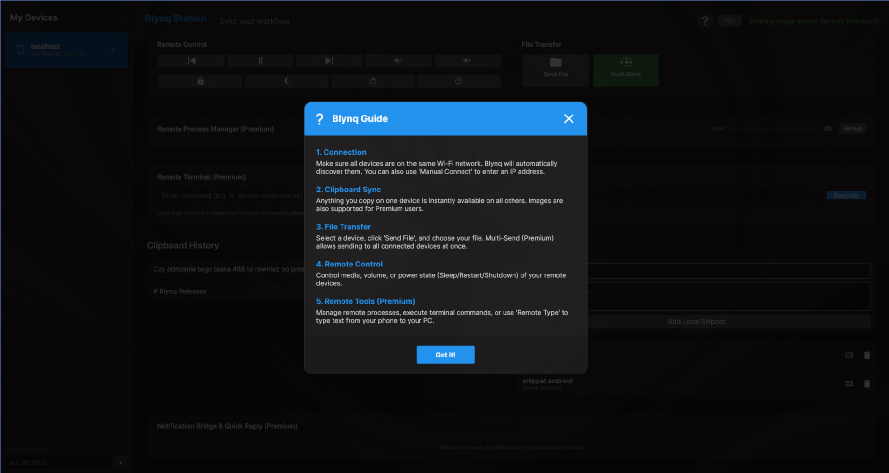

# Blynq Releases

[](https://github.com/Krzysiek-Mistrz/Blynq-releases)
[](https://github.com/Krzysiek-Mistrz/Blynq-releases)
[](https://github.com/Krzysiek-Mistrz/Blynq-releases)
[](https://github.com/Krzysiek-Mistrz/Blynq)

Welcome to the official release repository for **Blynq** – a lightweight, ultra-fast, cross-platform utility built with **Avalonia UI** and **.NET 10** for seamless workflow synchronization across your local network.

---

## Application Presentation & Screenshots

### Video Tour
Watch Blynq in action on Linux:  

[Watch Blynq short presentation](materials/short-video-presentation.mp4)

### Screenshots
<p align="center">
  
  
</p>

---

## Features

- **Bi-directional Clipboard Sync**: Instantly share your clipboard history between all your connected desktop and mobile devices.
- **Shared Snippets**: Keep frequently used text/commands tagged with their device-of-origin for quick access.
- **Remote Control**: Control media playback (Play/Pause, volume levels) and system power states (Sleep, Restart, Shutdown) bi-directionally (PC controls Android and vice-versa).
- **Asynchronous File Transfer**: Transfer files up to 50MB directly over the local network using memory-efficient TCP streams.
- **Smart Local Discovery**: Automatically detect Blynq instances on the local network (LAN/WLAN) via UDP discovery.

---

## Installation & Setup

### Linux

We offer multiple formats to run Blynq on your favorite Linux distribution:

#### 1. AppImage (Recommended)
The easiest way to run Blynq on any Linux distribution (Ubuntu, Fedora, Arch, etc.).
1. Download the latest `Blynq-x86_64.AppImage` from the [Releases](https://github.com/Krzysiek-Mistrz/Blynq-releases/releases) page.
2. Open your terminal and make the file executable:
```bash
chmod +x Blynq-x86_64.AppImage
```
3. Run it directly:
```bash
./Blynq-x86_64.AppImage
```

#### 2. Standard Tarball (.tar.gz)
1. Download the latest `Blynq-linux-x64.tar.gz` from the Releases page.
2. Extract the archive:
```bash
tar -xzf Blynq-linux-x64.tar.gz
```
3. Run the executable inside the directory:
```bash
./Blynq
```

#### 3. AUR (Arch User Repository) [In the future]
For Arch Linux users, Blynq will be available via the AUR. You will be able 2 install it using your preferred AUR helper (e.g., `yay`):
```bash
yay -S blynq-bin
```
*(If compiling manually, fetch the PKGBUILD from our PKGBUILD directory or AUR page, then run `makepkg -si`).*

> [!NOTE]
> **Firewall Setup:** If devices fail to discover each other, ensure the following local ports are open:
> * **55123/UDP** (UDP Discovery)
> * **55124/TCP** (Commands and Sync)
> * **55125/TCP** (File Transfer)
>
> On systemd/UFW systems, you can quickly allow them with:
> ```bash
> sudo ufw allow 55123/udp
> sudo ufw allow 55124/tcp
> sudo ufw allow 55125/tcp
> ```

---

### Android
Please note that We created this repository having mostly Linux on our mind :) We however have Blynq available on *Google Store* with the app name `Blynq`

---

### Windows
Please note that We created this repository having mostly Linux on our mind :) We however have Blynq available on *Microsoft Store* with the app name `Blynq`  

---

## Privacy Policy

We take your privacy seriously. Blynq is designed to operate **entirely locally**:
- **No Cloud Servers**: Your clipboard, files, and commands are sent directly from device to device over your local network. No external servers or telemetry are used. In the future We hope to be able to give you the opportunity to be able to send files from one device to another even if your devices are very far away. I will utilize this functionality using my own server. Even then your data is always yours. I won't collect anything sent over my own servers.  
- **Zero Tracking**: We do not collect, store, or sell any of your personal data or usage statistics.

For full details, please refer to our official. Please note that the privacy policy is polish. Later it may be converted 2 english: [Privacy Policy (Polityka Prywatności)](https://chrisengineer.ddns.net/archives/strony-glowne/polityka-prywatnosci.php).

---

## Main Repository
The core application project and issue tracker are located in the private main repository:
[Krzysiek-Mistrz/Blynq](https://github.com/Krzysiek-Mistrz/Blynq)  
It's closed code as it should be for most apps utilizing their own security-important code (stripe payments, encryption mechanisms, ...).